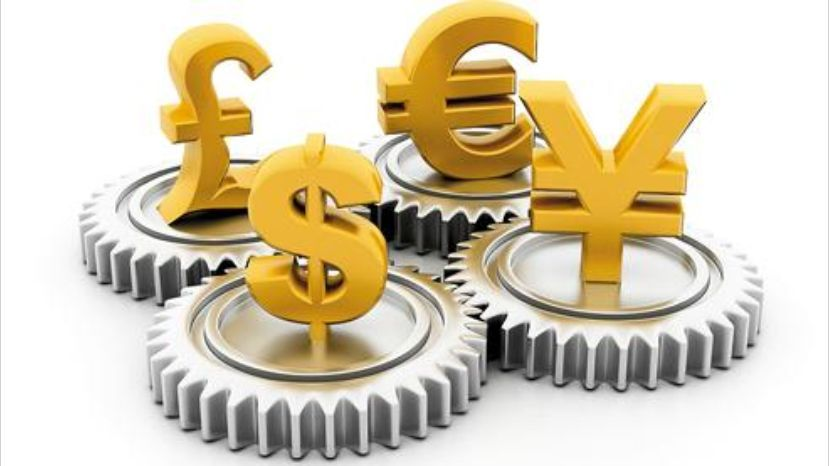
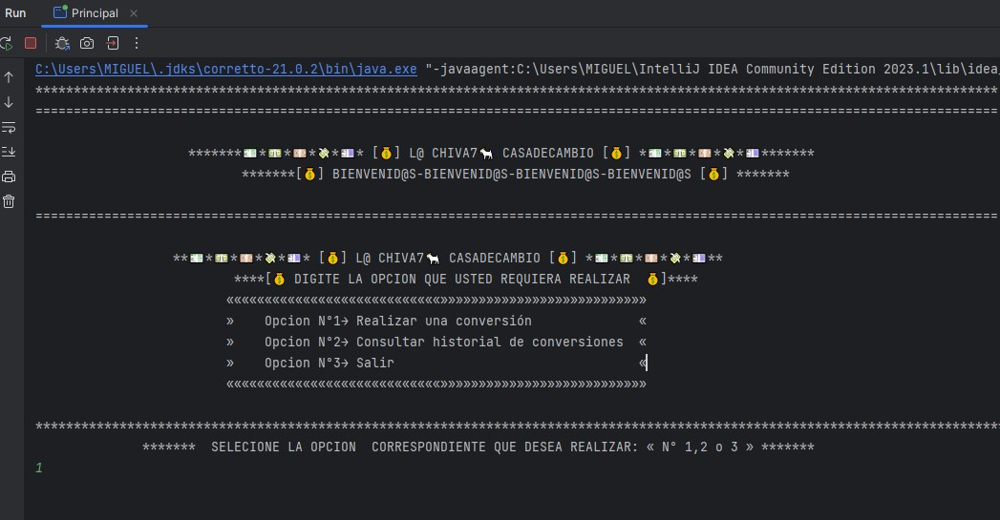
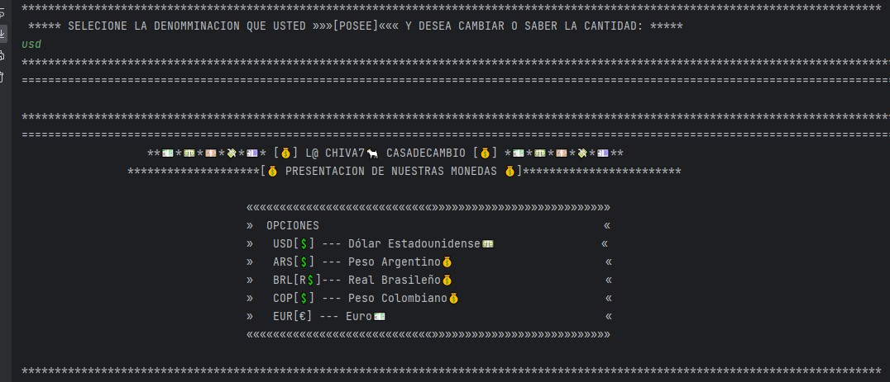
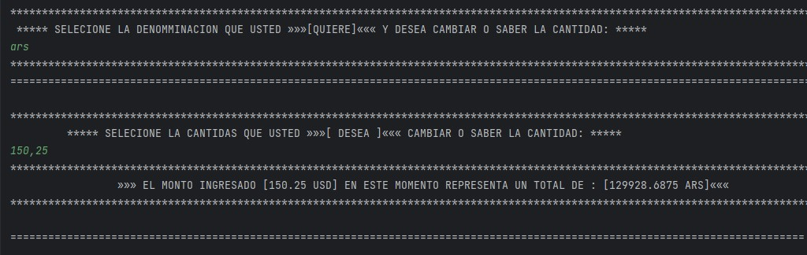
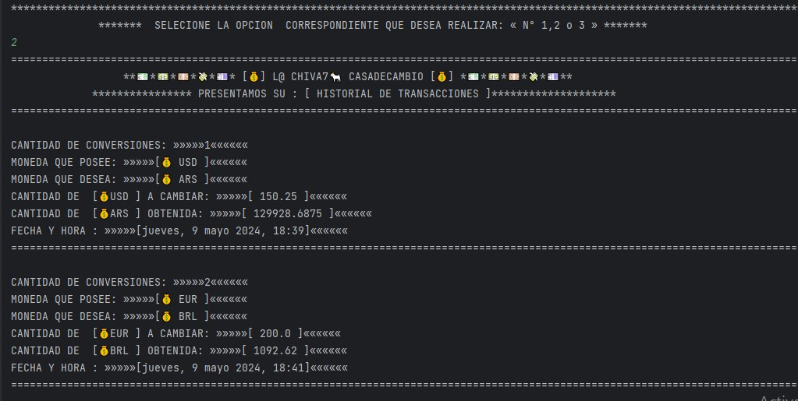
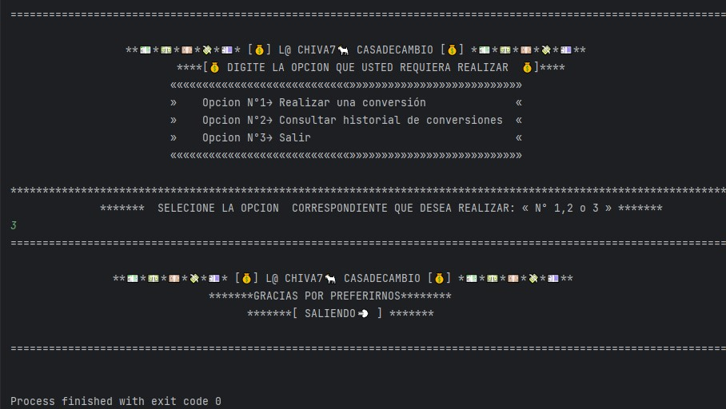

## 
# **Challenge Conversor Divisas**
# ***[💰] L@ CHIVA7🐐 CASADECAMBIO [💰]*** 
  

1- Realizacion de un programa que permite hacer la conversion del valor de distintas monedas a otras para obtener su valor en referencia de la misma, cuenta con las siguientes caracteristicas:

- Presenta un menu que permite al usuario una comunicacion amigable 📑

- Se puede convertir la cantida que el usuario decida y asi saber su valor 💰

- Presenta la posibilidad de guardar un historial de transacciones, esto se logra aplicando los resultdos satisfactorios en un arrayList

- Solicita a la API FastForex los datos actualizados del valor de las monedas

- Las tranzacciones presentan una fecha y hora para los reistros 

2- El editor usado para este proyecto es el IDE 

3- El archivo READMI, se crea usando 

4- Cuenta con repositorio local  y remoto 

5- Apoyado de un repositorio de  "https://ileriayo.github.io/markdown-badges" para gestionar estos badges estaticos.

6- Con colaboracionde grupo de estudio en , 

7-Se deja una pequeña presentacion de lo que puede hacer este simpatico proyecto
### ***
 💰Menu Principal
***

### ***
 💰Menu Monedas Disponibles
***
 
### ***
 💰Seleccion de las Monedas
***
 
### ***
 💰Mostrando resultados
***
 
### ***
 💰Historial de Transaciones
***
 
### ***
 💨 Finalizacion o salida 
***
 